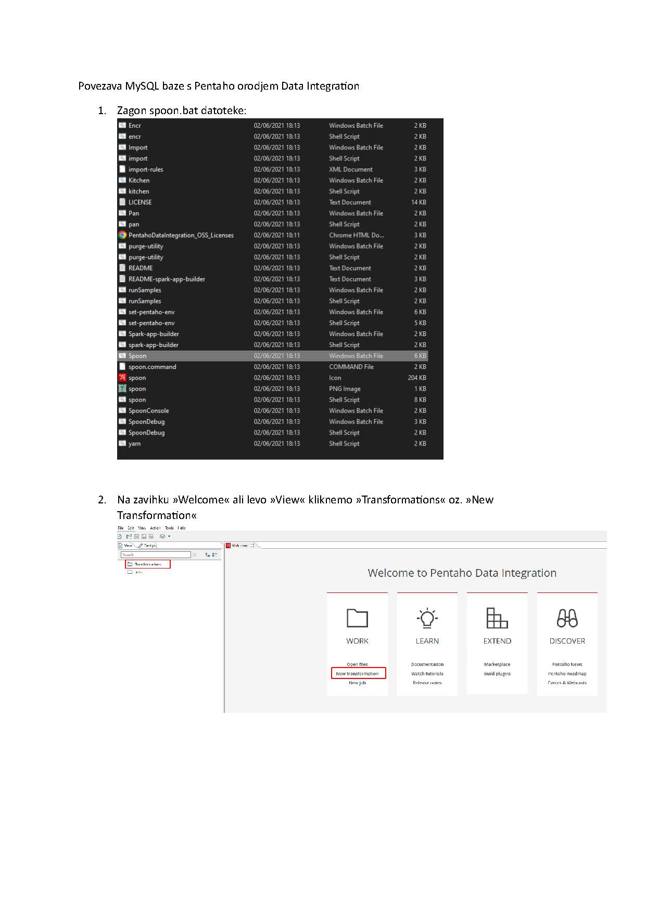
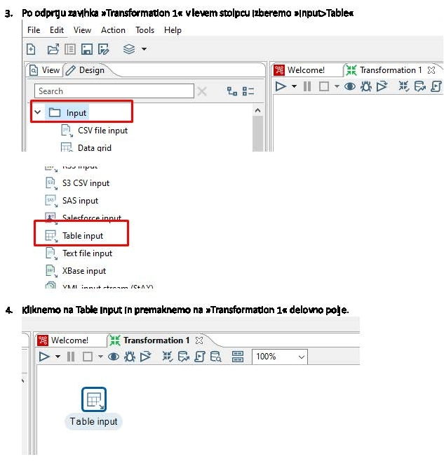
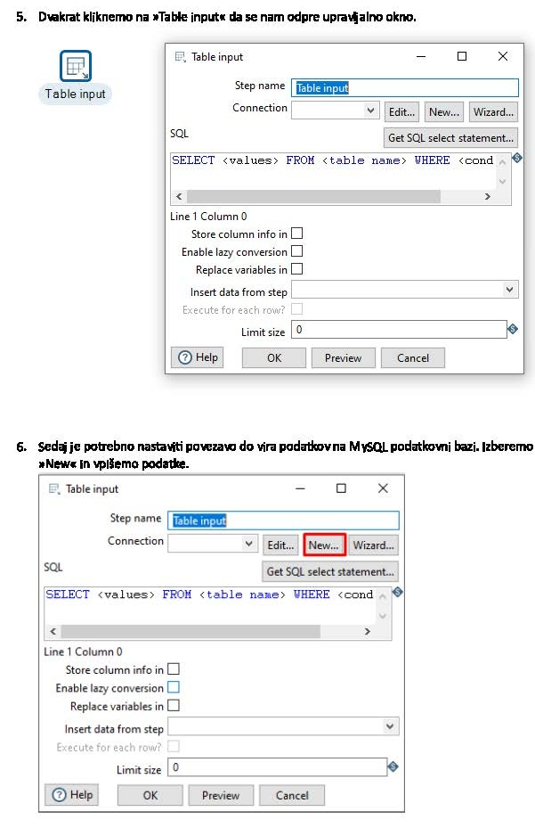
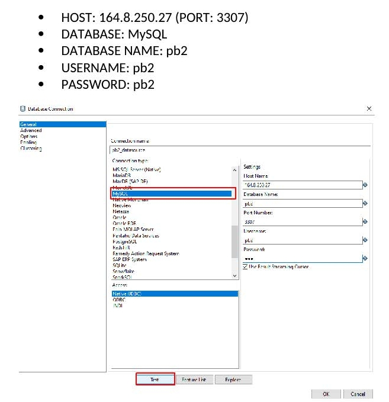
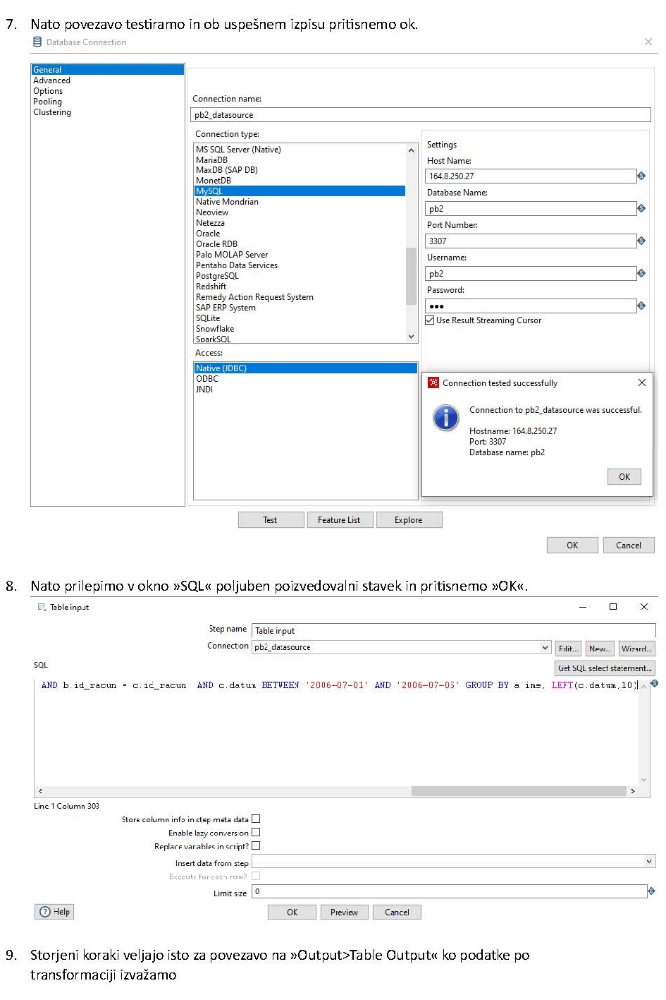
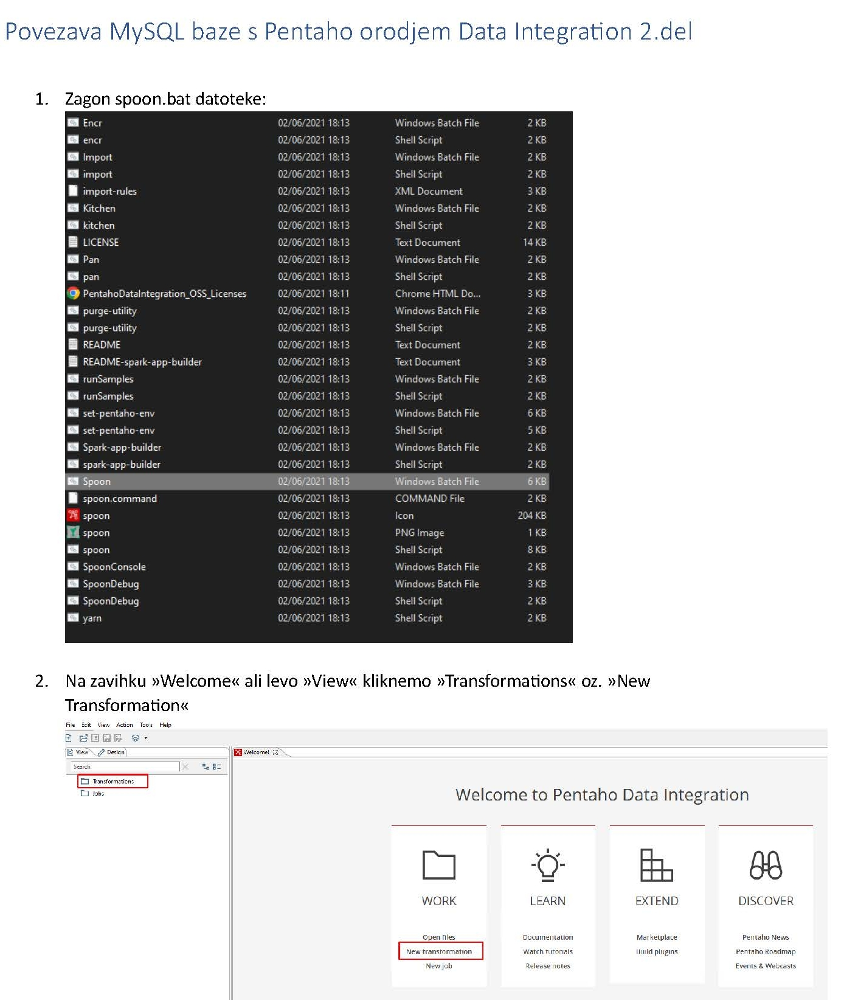
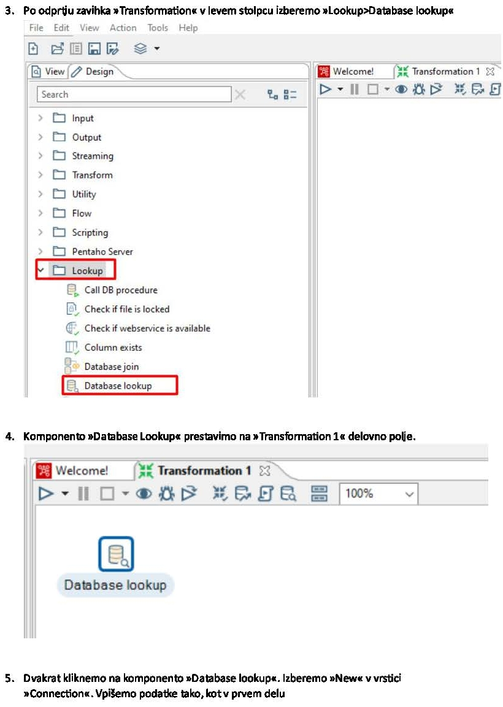
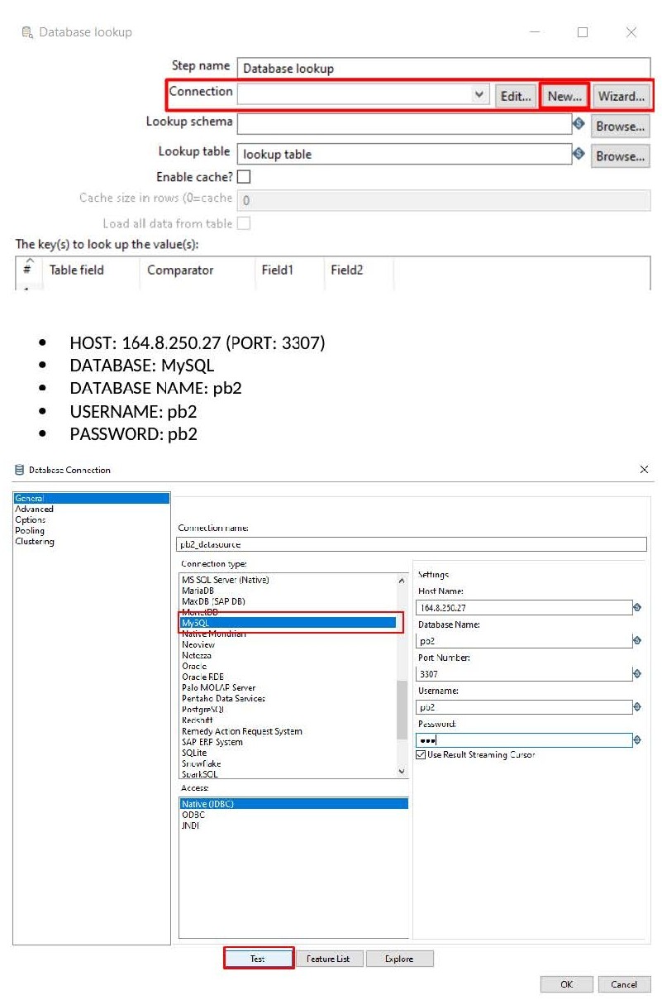
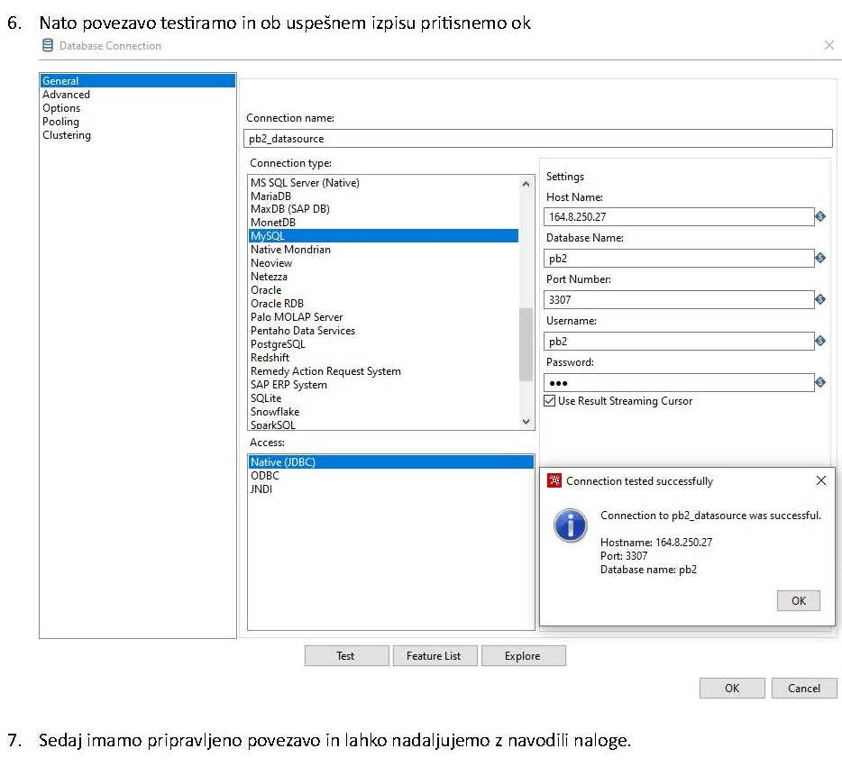

## Dodatno gradivo za vaje pri predmetu Podatkovno skladiščenje

## Namestitev orodja Pentaho

### Vzpostavitev povezavo z bazo

*Navodila kako vzpostaviti Pentaho Data Integration ter povezati MySQL podatkovno bazo.*

*Navodila kako vzpostaviti povezavo na Database Lookup*

Shield: [![CC BY-SA 4.0][cc-by-sa-shield]][cc-by-sa]

Material in this folder is licensed under a
[Creative Commons Attribution-ShareAlike 4.0 International License][cc-by-sa].

[![CC BY-SA 4.0][cc-by-sa-image]][cc-by-sa]

[cc-by-sa]: http://creativecommons.org/licenses/by-sa/4.0/
[cc-by-sa-image]: https://licensebuttons.net/l/by-sa/4.0/88x31.png
[cc-by-sa-shield]: https://img.shields.io/badge/License-CC%20BY--SA%204.0-lightgrey.svg
