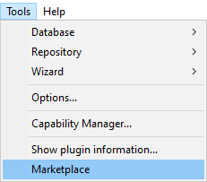
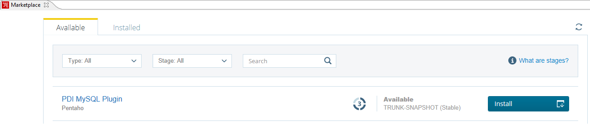

## Dodatno gradivo za vaje pri predmetu Podatkovno skladiščenje

## Namestitev orodja Pentaho

### Vzpostavitev povezave z bazo
Za uspešno povezavo na MySQL je treba namestiti [MySQL Connector](https://downloads.mysql.com/archives/c-j/). Pri prenosu zagotovite, da bo "Operating System" nastavljen na "Platform Independent" in "Product Version" na "5.1.49". Nameščeno ``.jar`` in ``.bin.jar`` datoteko je treba premakniti v ustrezno mapo znotraj Pentaho direktorija (``data-integration/lib``). Pentaho naj bo med namestitvijo zaprt, sicer lahko pride do zapletov. 

V opravilni vrstici izberite ``Tools > Marketplace`` in namestite ``PDI MySQL Plugin``. Po namestitvi znova zaženite Pentaho.  
  

*Navodila za vzpostavitev orodja Pentaho Data Integration in povezave na MySQL podatkovno bazo.*

