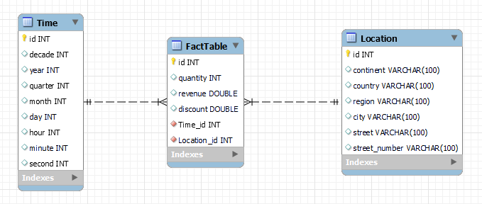

# Dimenzijsko modeliranje
## Namestitev MySQL Workbench
Prenesite in namestite MySQL Workbench iz [te povezave](https://dev.mysql.com/downloads/workbench).  
  

## Uporaba orodja MySQL Workbench
### Ustvarjanje novega modela
Za ustvarjanje novega modela, kliknite na ``File > New Model`` (oziroma Ctrl + N). Nato v razdelku ``Model Overview`` kliknite na "Add Diagram".  
  
  

### Dodajanje nove tabele
Za dodajanje nove tabele kliknite na ikono, prikazano na spodnji sliki, nato pa kliknite na poljubno mesto na mreži.  
  
Po dvojnem kliku na novo ustvarjeno tabelo se v spodnjem delu MySQL Workbench odpre nov razdelek, v katerem lahko tabelo preimenujete, dodate nove atribute, spreminjate njihove tipe, največje dovoljene dolžine ter omejitve.  
  

### Dodajanje relacij
Za dodajanje relacij med tabelami kliknite na katerokoli ikono na spodnji sliki. Po izbiri tipa relacije, kliknite na tabelo, s katero želite vzpostaviti relacijo, nato pa še na tabelo, s katero želite vzpostaviti relacijo. Pri tem bodite pozorni na ustreznost smeri in kardinalnost relacije.  
  
  

## Dimenzijski model
### Dimenzija "Čas"
Na spodnji sliki je prikazan primer dimenzijske tabele "Čas", ki vsebuje atribute desetletje, leto, četrtletje, mesec, dan, ura, minuta in sekunda.  
  

### Dimenzija "Lokacija"
Na spodnji sliki je prikazan primer dimenzijske tabele "Lokacija", ki vsebuje atribute kontinent, država, regija, mesto, ulica in hišna številka.  
  

### Tabela dejstev
Na spodnji sliki je prikazan primer tabele dejstev (za beleženje prodaj v trgovini), ki vsebuje atribute količina, cena, popust in način plačila. Zaenkrat še ne vsebuje tujih ključev na dimenzijske tabele.  
  

### Končen dimenzijski model
Spodnja slika prikazuje končen dimenzijski model, ki vsebuje dimenziji "Čas" in "Lokacija", ter tabelo dejstev.  
  